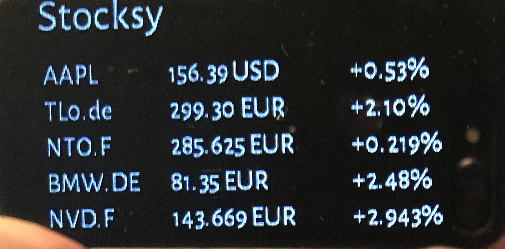

# mirrOS Stock Market Modul

Shows your stocks from the market

## REquirements

* Raspberry with installed [mirrOS](https://glancr.de/mirr-os/)

## Download

here @ github or on my Website
* [Stocksy Module](http://alexanderdeutsch.de/stocksy)

## Stocksy module in action

## Weitere Informationen
* [Stocksy Module](http://alexanderdeutsch.de/stocksy)

* [My Website](http://alexanderdeutsch.de)

## Thanks To

tanken app helped me a lot as a template for the stocksy app and the guys from glancr for making an incredible job with mirr.os
* [Marco Roth auf glancr.de](https://glancr.de/entwickler/marco-roth/)

* [Glancr](https://glancr.de)
* [mirrOS](https://glancr.de/#mirr_os)
